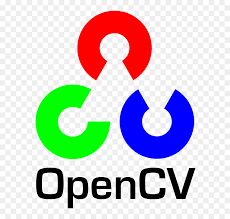

# OpenCV_projects
This repo contains Image processing projects using python (OpenCV library).

### Tools and Languages Used:



<br>

### Installing Libraries

```cmd
pip install numpy
pip install opencv
pip install times

```
-> We use numpy library as it contains a multi-dimensional array and matrix data structures. It can be utilised to perform a number of mathematical operations on arrays such as trigonometric, statistical, and algebraic routines.
-> We use OpenCV library because it is a cross-platform library using which we can develop real-time computer vision applications. It mainly focuses on image processing, video capture and analysis including features like face detection and object detection.

## It includes following projects
----
1. Add text to video stream
2. Add date and time to the video stream
3. customising frame resolutions
4. Accessing webcam and record video
5. Drawing geometrical shapes 
6. Greyscale image
7. Read image and copy it
8. mouse events 1
9. mouse events 2
10. Setting camera parameters
----

### Steps to follow
-Install the given libraries<br>
-Download the code from the given github repository<br>
-Run the code<br><br>

### Developed by:
<a href="https://github.com/sambit221">Sambit Kumar Tripathy</a>

